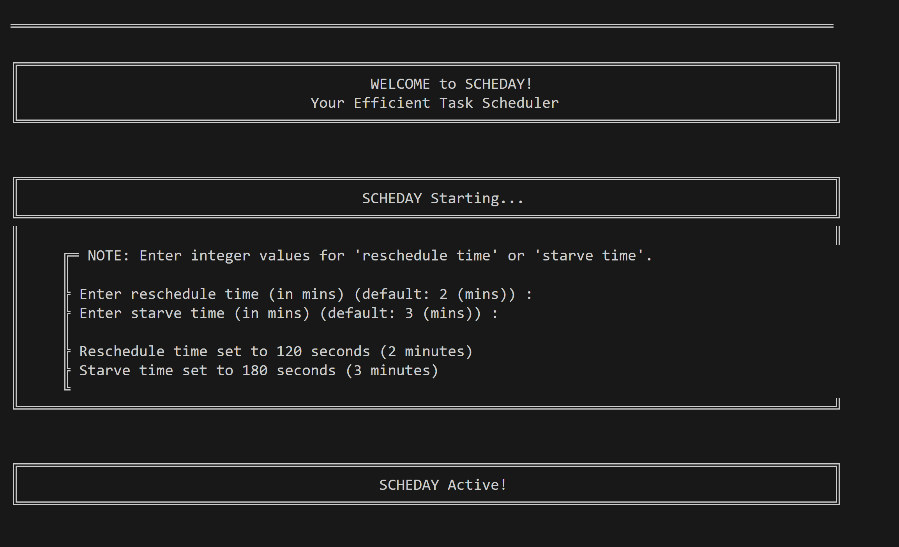
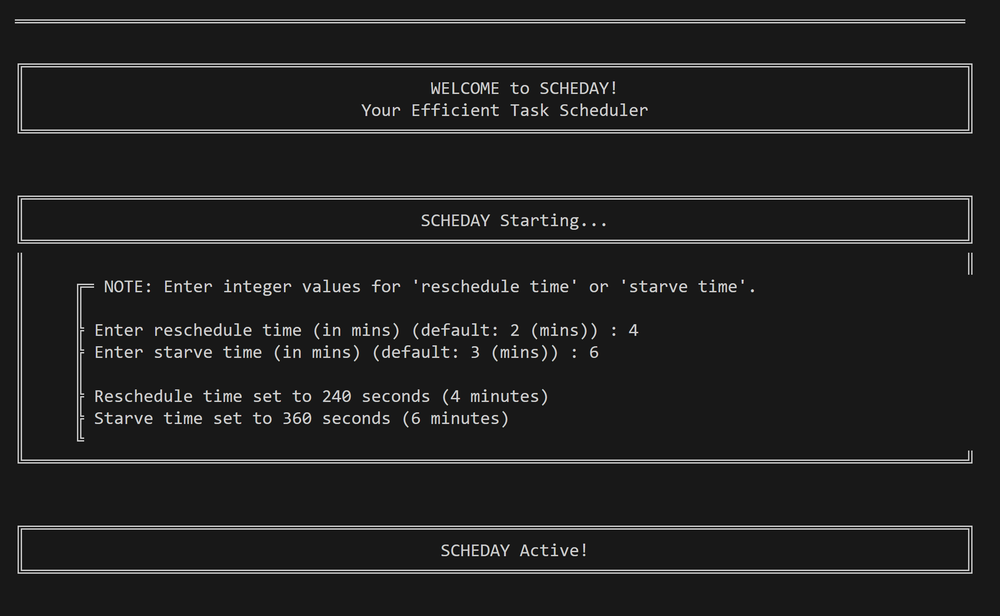
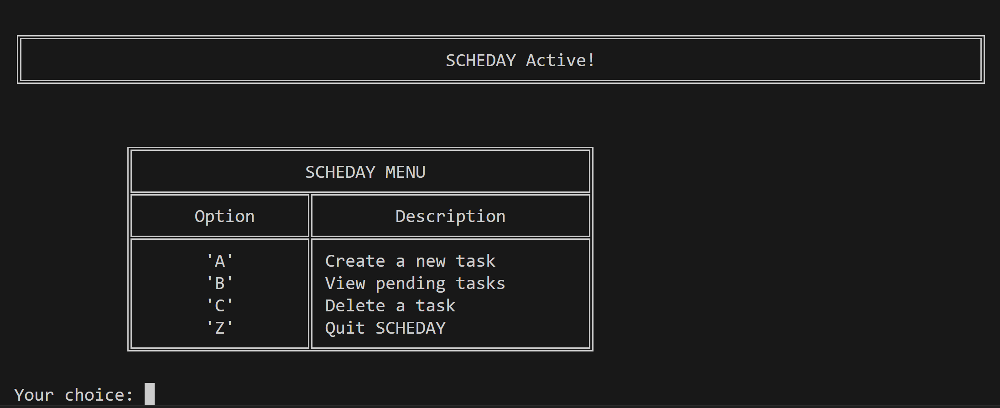
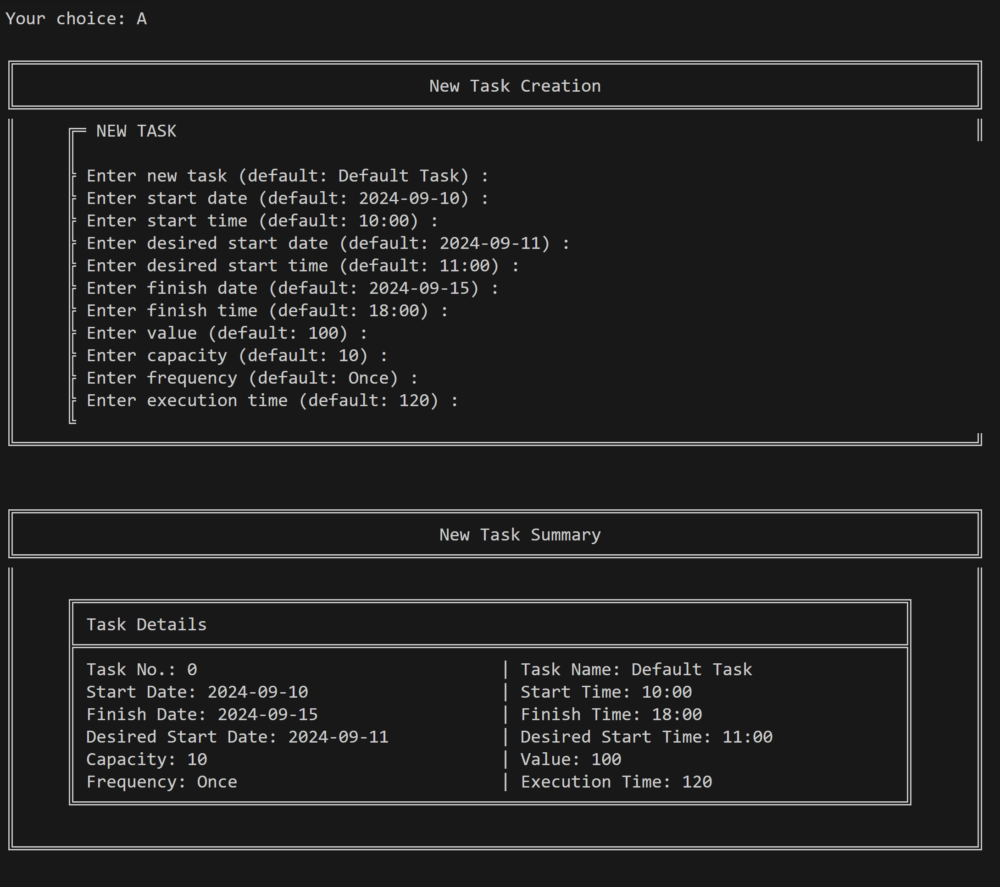
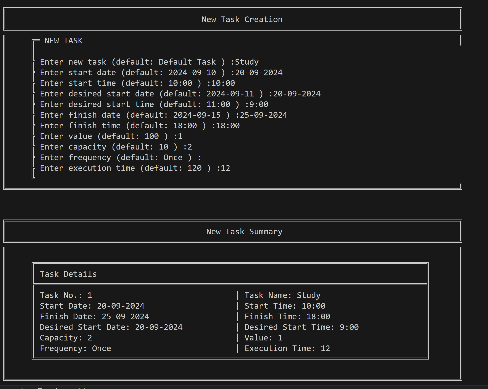
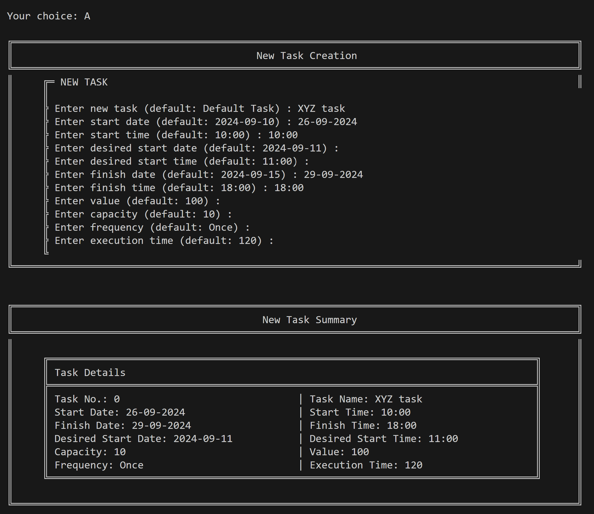
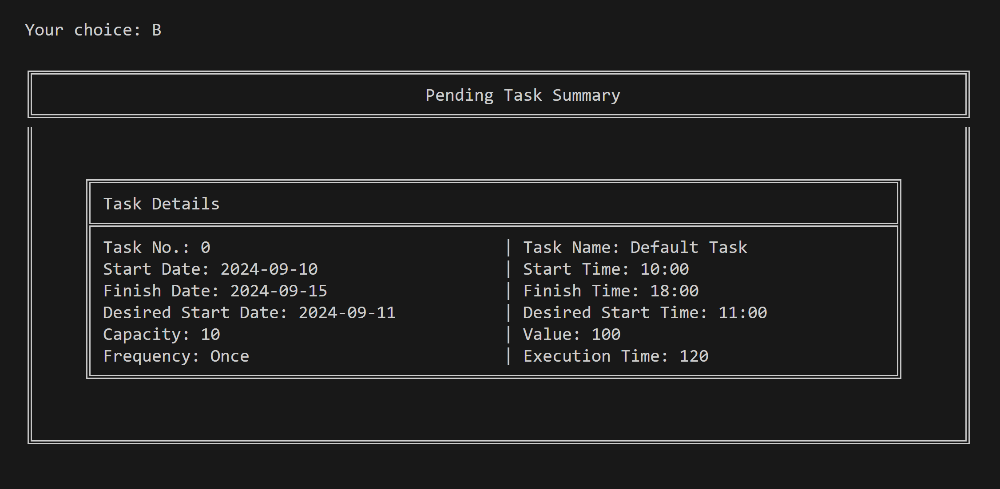
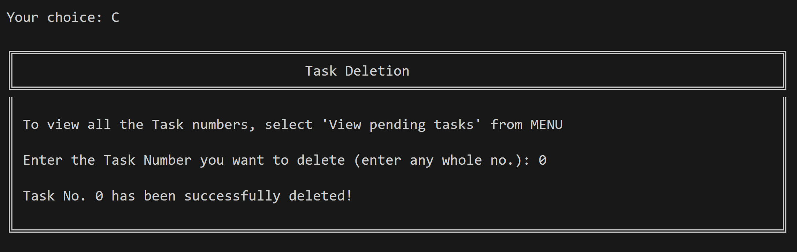
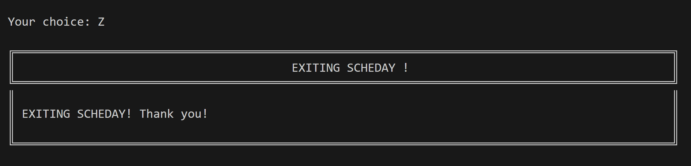
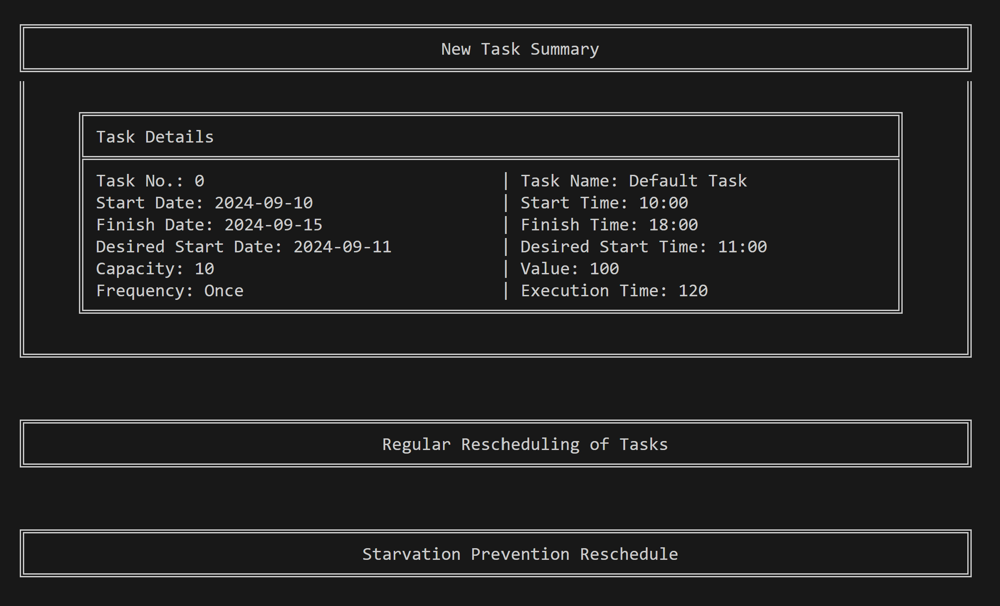

<a name="readme-top"></a>
# Efficient-Task-Scheduler-SCHEDAY

```Scheday``` is a complex ```scheduler```, implemented using the concepts of classes.

<br>

<details open>

  <summary style="color: red;">Table of Contents</summary>
<li> <a href="#a1">Introduction</a></li>
<li> <a href="#a2"> Prerequisites and Techstack</a></li>
<li> <a href="#a3"> Steps for Execution </a></li>
<li> <a href="#a5">Screenshots</a></li>
<li> <a href="#a4">Usage</a></li>
<li> <a href="#a5">Final Outcome</a></li>
<li> <a href="#a6">Expansion</a></li>
  <li> Objective </li>

<a href="#end"><u><i>Skip to END...</i></u></a>
</details>
</br>

<a name="a1"></a>
## Introduction
* The name of this idea is "Scheday" which stands for 'Scheduler for the day'. (ie, for any day it gives maximum value )
* The scheduler has the following properties-
    *	New jobs - As and when new jobs are added it is added to a waiting list.
    *	Rescheduling- After a certain time, say 'reschedule time' the scheduler reschedules all the jobs, except the current running job.
    That is all jobs in the scheduler plus the jobs in waiting list are rescheduled (with the exception of the current running job).
    This 'reschedule time' can be 5min Or 2min , according to user requirements.
    *	Priority - Based on the desired start time, the job has to be started within 2 hrs of that. Based on this priority is given.
      While taking care of this completion time is also kept in mind.
    *	Starvation- After a certain amount of time, say 'starve time' the jobs are reviewed.
    In this review,the job that will execute last is rescheduled in between of the jobs before it depending on the desired start time and completion time.
    After every 'starve time' this review occurs. 'starve time' can be say 10min Or 5min , depending on no of tasks etc.
    *	Analysis- All of these tasks, their start time, completion time, desired start time, if the task is completed etc is stored in a csv Or excel.
      From this csv Or excel required data is got and analysed by a code, which gives output as basic reports
  </br>


  
### <b>Features:</b> 
  
    *	One can dynamically add new tasks.
    *	One can view pending task details as a list.
  
    *	Tasks can be entered on this.
  
    *	At a time thousand tasks can be run.
  
    *	Tasks can also be executed from a csv wherein it reads each and every task and executes them.
  

</br>


### <b>Files :</b> 
The ```Efficient-Task-Scheduler-SCHEDAY directory``` contains the following files:
  
  - ```'SCHEDAY.py' File```- contains the ***'SCHEDAY' application*** code.
    
  - ```'Screenshots' Directory```- contains ***Screenshots on various tasks*** from the SCHEDAY application.
</br>

### <b>Repository Structure :</b> 

<details>
  <summary color= blue ><u><b><i>Efficient-Task-Scheduler-SCHEDAY repo structure</i></b> click...</u></summary>

  Below is the structure of the ```Efficient-Task-Scheduler-SCHEDAY``` project repository
  
  ```plaintext
    Efficient-Task-Scheduler-SCHEDAY/
    │   
    ├── SCHEDAY/           # Project Folder
    │   │              
    │   ├── SCHEDAY.py              # Application
    │   │     
    │   │ 
    │   ├── Screenshots/            # Screenshots-Folder              
    │   │    ├── Image_1a.png
    │   │    ├── Image_1b.png
    │   │    ├── Image_2.png
    │   │    ├── Image_3a.png
    │   │    ├── Image_3b.png
    │   │    ├── Image_3c.png
    │   │    ├── Image_4a.png
    │   │    ├── Image_4c.png
    │   │    ├── Image_5.png
    │   │    ├── Image_6.png
    │   │    ├── Image_r1.png
    │   │    ├── Image_r2.png     
    │   │    └──# 
    │   │ 
    │   └──#
    │   
    └─── README.md           # Repository README
    
  ```

</details>
</br>


### <b>Objective :</b> 
To build an ```efficient scheduler application``` which -
1.	Can accomodate <i>new tasks</i>
2.	Has <i>no job starvation</i>
3.	Starts any task within 2 hours of its <i>desired start time</i>.
4.	Can provide basic statistical and analytical <i>report</i>, such as jobs for day, capacity utilization for day, etc..
</br>


###
###

  <p align="right"><a href="#readme-top">Back to TOP</a></p>
  </br>


  
<a name="a2"></a>
## Prerequisites and Techstack

<br>
    
  * Language :

    **Python**

<br>

  * Libraries :


    * schedule
    * time
    * sys

<br>

 * Alternative techstack :

   Various languages such as python, c, html, react, etc... can be used to implement scheday.
  <p align="right"><a href="#readme-top">Back to TOP</a></p>
  </br>
  
  

<a name="a3"></a> 
## Steps for Execution

<br>

 1. Clone the ```'Efficient-Task-Scheduler-SCHEDAY'``` github repository.
 
  ```sh 
  git clone https://github.com/ankitacoder3/Efficient-Task-Scheduler-SCHEDAY.git 
  ```

 2. Navigate to the ``` 'SCHEDAY' ``` directory in that.
    
  ```sh
  cd Efficient-Task-Scheduler-SCHEDAY
  cd SCHEDAY
  ```

  3. Open the ```SCHEDAY.py``` in any code editor (say, ***VS Code***). 
  <br>

  4. Run ```SCHEDAY.py``` from the ***Command Prompt*** or the ***Terminal***.
  ```sh
  python SCHEDAY.py
  ```
  5. The ***SCHEDAY*** application can be viewed on the ***COMMAND LINE*** interface.
  6. <b>User Inputs</b> for the ***SCHEDAY*** application are as follows:

		i. For ```"Enter reschedule time (in mins) (default: 2 (mins)) :"```, press ***'ENTER' KEY*** or ***enter any whole number***.

		ii. For ```"Enter starve time (in mins) (default: 3 (mins)) :"```, press ***'ENTER' KEY*** or ***enter any whole number***.

        iii. Follow the ```***SCHEDAY MENU***``` to <i>create, view and delete TASKS</i>; By ***entering the corresponding option*** for each in the ```"Your choice:" ```input.

		iv. In ```"New Task Creation" panel or section```, for each field either press the 'ENTER' KEY or input the <i> desired Value</i> in the same 'FORMAT' as shown by 'DEFAULT INPUT'.

		v. In ```"Task Deletion" panel or section```, for "Enter the Task Number you want to delete (enter any whole no.):", enter any whole number for Task No. .

  7. To view sample ***Screenshots*** of the ***SCHEDAY*** application, navigate to the ***"Screenshots" Directory*** and open any <b>Image</b> there. (For description of screenshots, <a href="#a5">click here</a>.) 

  * Note: The <i>SCHEDAY</i> application can also be run from the <i>python idle</i> by selecting the <i>'run module'</i> option, and output can be viewed in the <i>IDLE SHELL</i>.

  <p align="right"><a href="#readme-top">Back to TOP</a></p>
  </br>
  


  <p align="right"><a href="#readme-top">Back to TOP</a></p>
  </br>

   <a name="a5"></a> 
## Screenshots

  * Below are few screenshots of the ***SCHEDAY*** application:

1.	SCHEDAY STARTING
   
      a. With default inputs
  	

      b. With user-defined inputs
	

2.	SCHEDAY MENU
        
  	
4.	NEW TASK
    
      a. With default inputs
  	
   
      b. With user-defined inputs
        

      c. With hybrid input
         
  	
4.	PENDING TASK SUMMARY

      a. With default inputs
  	 

6.	TASK DELETION
  	
   
7.	EXITING SCHEDAY
        

8.	TASK RESCHEDULING
        

  * Other screenshots, and all the above screenshots can be found in the ```"./SCHEDAY/Screenshots/"``` folder.

  <p align="right"><a href="#readme-top">Back to TOP</a></p>
  </br>
   </br>
<a name="a4"></a>
## Usage

<br>

* ***SCHEDAY scheduler*** can be used for several applications in different areas of life.

* To ***plan*** events or activities for any person or customer.

* To ***schedule events*** for systems.

* To help people ***plan and prioritize their work***, etc...


  <p align="right"><a href="#readme-top">Back to TOP</a></p>
  </br>

  <a name="a5"></a> ## Final outcome 

* The application can be made web compatible.
* It can deployed on a real time website which would enable huge no. of people to plan and  use their time efficiently and productively.
* This website will be easily accessible, feasible, and user-friendly

<p align="right"><a href="#readme-top">back to top</a></p>
  </br>

   <a name="a6"></a> 
## Expansion

- ***SCHEDAY*** idea can be expanded in the following ways:

1.	Deployed on a website In this way the user can schedule a task for his computer from remote locations
2.	GUI can be added For making it wasy for the user to interpret this application
3. Remaining unimplemented points in ideology can be implemented


  <p align="right"><a href="#readme-top">Back to TOP</a></p>
  </br>
  
<a name="end"></a>
Thank you for exploring the SCHEDAY project.
